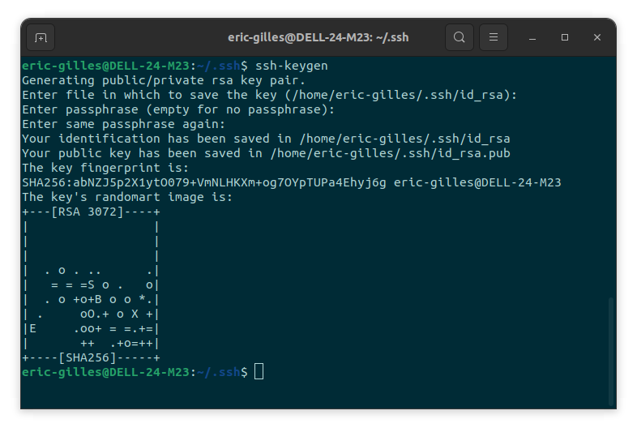
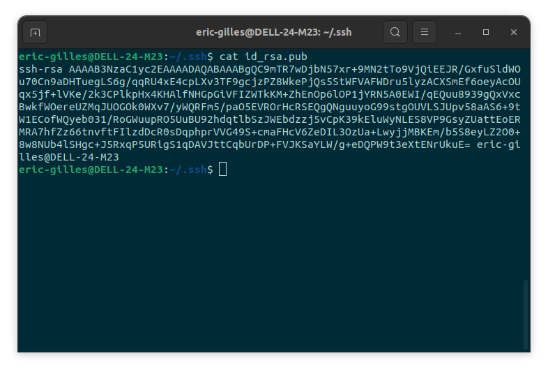
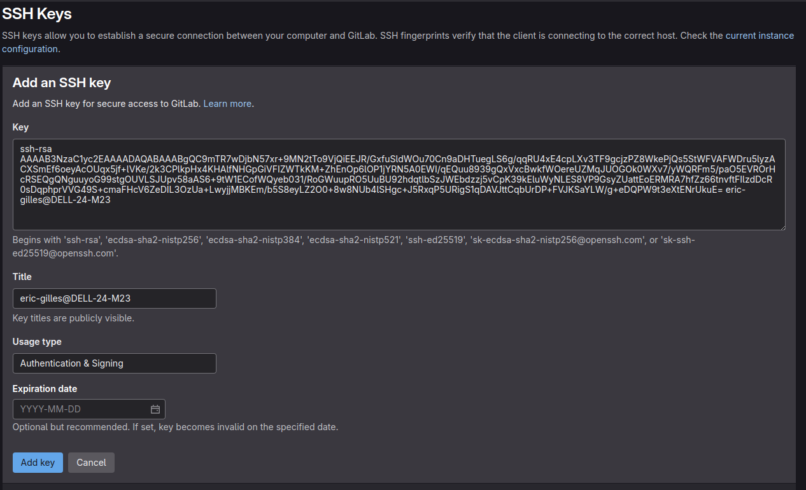
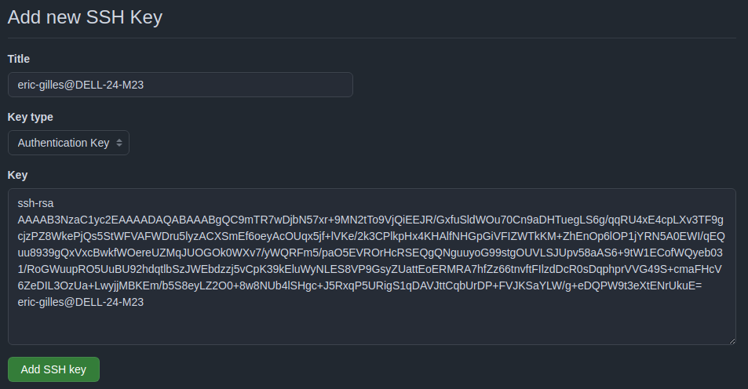
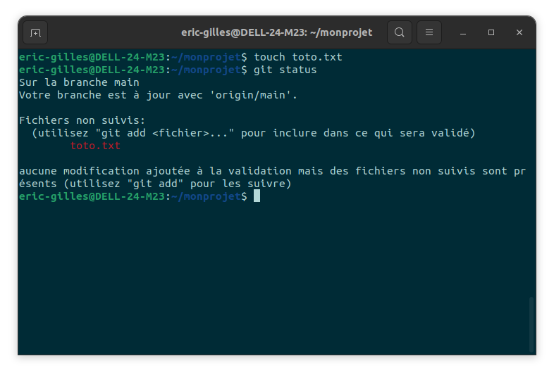
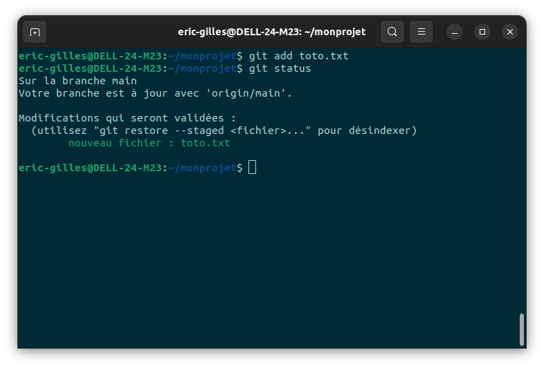
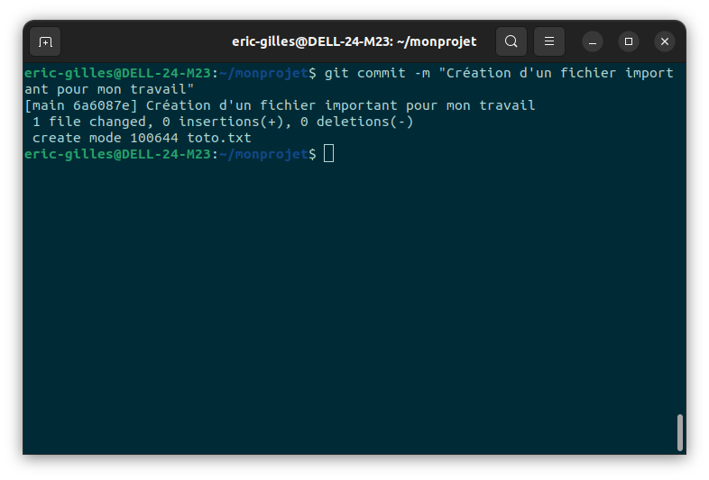
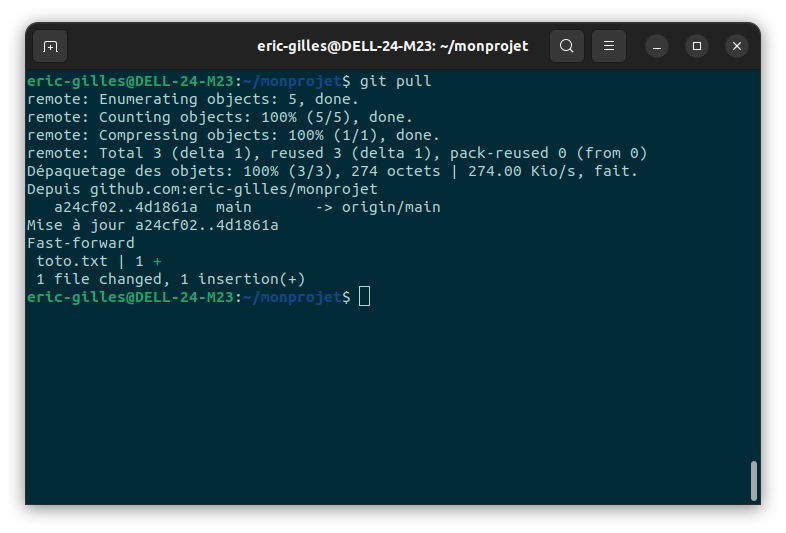
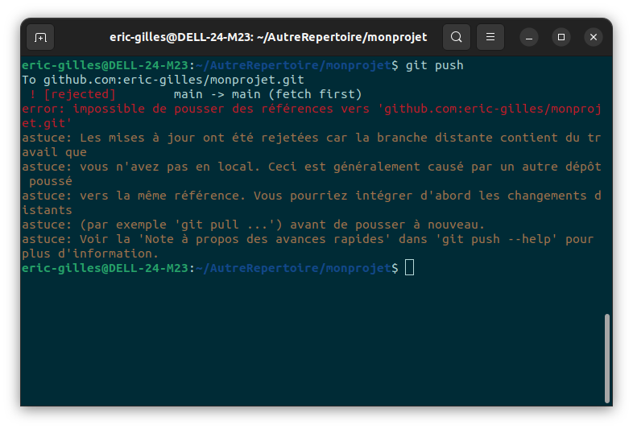
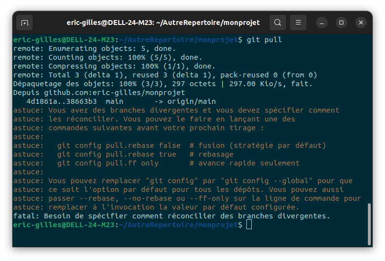

# Tuto GIT

## Introduction
Bienvenue dans ce guide complet sur Git et GitHub. Ce tutoriel vous expliquera les bases de Git, comment résoudre les conflits, configurer votre environnement et bien plus encore.

Voir toutes les commandes GIT de base : [ici](https://github.com/eric-gilles/tutoGit/blob/main/ressources/git-cheat-sheet-education.pdf)

# Sommaire

1. [Introduction](#introduction)
2. [Découverte de Git et premiers codes versionnés](#découverte-de-git-et-premiers-codes-versionnés)
3. [Création d'un compte GitLab/GitHub](#création-dun-compte-gitlabgithub)
4. [SSH](#ssh)
5. [Commandes](#commandes)
6. [Utilitaires Git](#utilitaires-git) dont [GitHub Desktop](#github-desktop)
7. [Prise en main de Git](#prise-en-main-de-git) dont [Configuration locale de Git](#configuration-locale-de-git)
8. [Git Add, Git Status et Git Commit](#git-add-git-status-et-git-commit) dont [Conventions de commit](#conventions-de-commit) et [Résumé des commandes](#résumé-des-commandes)
9. [.Gitignore ignorer les fichiers inintéressants](#gitignore-ignorer-les-fichiers-inintéressants) dont [Génération de fichier `.gitignore`](#génération-de-fichier-gitignore)
10. [Git Pull récupérer les modifications distantes](#git-pull-récupérer-les-modifications-distantes)
11. [Git Log : Affichage du journal des enregistrements (`commit`)](#git-log--affichage-du-journal-des-enregistrements-commit)
12. [Résolution des conflits](#résolution-des-conflits)
13. [Sub Module Git](#sub-module-git)
14. [Cosmétique (optionnel)](#un-peu-plus-de-cosmétique-optionnel)
15. [Aller plus loin avec Git](#aller-plus-loin-avec-git)
16. [Auteur et Remerciements](#auteur)


## Découverte de Git et premiers codes versionnés

L'objectif de ce tutoriel est de vous familiariser avec des outils qui vous aideront à vous organiser dans votre travail de programmation.  
Le but d'un [gestionnaire de version](https://fr.wikipedia.org/wiki/Gestion_de_versions) est de vous permettre de conserver l'historique de vos réalisations, de revenir à une étape en arrière de votre historique et de collaborer avec d'autres utilisateurs.  
On dit qu'un code est _versionné_ s'il y a une trace de son historique que l'on peut facilement retrouver et partager avec quelqu'un d'autre.

### Introduction à Git et préparation de l'environnement

Le gestionnaire de version que vous allez utiliser ici sera [Git](https://fr.wikipedia.org/wiki/Git).  
Il s'installe localement sur la machine sur laquelle vous travaillez.  
Ensuite pour diffuser votre travail et permettre à tous vos postes de travail de partager le même projet, vous devrez utiliser une **plateforme collaborative**.  
[GitLab](https://gitlab.com) ou [GitHub](https://github.com/login) sont des exemples de telles plateformes. Elles vous permettent de stocker votre projet sur un serveur distant et de le partager avec d'autres utilisateurs.

## Création d'un compte GitLab/GitHub
Il est nécessaire de réaliser la création de compte sur une plateforme collaborative pour pouvoir stocker vos projets. 
- [Créer un compte GitLab](https://gitlab.com/users/sign_in)
- [Créer un compte GitHub](https://github.com/login)

Sans compte sur une de ces plateformes, vous ne pourrez pas utiliser Git de manière optimale, ainsi que les fonctionnalités de collaboration qu'elles offrent et la suite de ce tutoriel.

## SSH 
Avant de commencer à créer des projets, il faudrait établir un canal sécurisé d'authentification entre votre machine et le serveur distant.  
Pour cela, ouvrez un terminal sur votre machine et générer une clé SSH avec `ssh-keygen` dans le dossier `.ssh/`  
Appuyez sur `Entrée` à la demande `Enter the file` puis tapez 2 fois un mot de passe (passphrase)



### Commandes :
```sh
cd ~/.ssh
ssh-keygen
```

Ensuite, copiez la clé SSH :
```sh
cat id_rsa.pub
```



Pour GitLab, ouvrir le lien suivant : _[GitLab Lien SSH Key](https://gitlab.com/-/user_settings/ssh_keys)_ et cliquez sur le bouton "Add new Key", puis collez la clé que vous avez copiée précédemment dans le champ "Key" et donnez un nom à votre clé.

<br/>

Pour GitHub, ouvrir le lien suivant : _[GitHub Lien SSH Key](https://github.com/settings/ssh/new)_ et donnez un titre à votre clé et collez la clé dans le champ "Key".

<br/>

**Remarque** : avant d'aller plus loin sachez que si vous voulez travailler depuis un autre ordinateur chez vous,
vous devez faire au préalable la procédure d'échange de clé décrite ci-dessus.

**Remarque :** Le mini-tutoriel qui suit est fait pour Linux. Il s'adapte facilement sur Mac OS.
Pour les utilisateurs de Windows il faudrait adapter les commandes Unix à celles de Windows ou installer un émulateur comme [Git for Windows](https://gitforwindows.org/) qui permet de simuler l'utilisation de Git comme si vous étiez sous Linux ou alors utilisez [GitHub Desktop](https://desktop.github.com/).

## Utilitaires Git
Il existe plusieurs utilitaires pour Git qui facilitent l'utilisation de Git en offrant une interface graphique :
- [GitKraken](https://www.gitkraken.com/)
- [GitHub Desktop](https://desktop.github.com/)
- [Sourcetree](https://www.sourcetreeapp.com/)
- IDE : la plupart des IDE ([IntelliJ](https://www.jetbrains.com/fr-fr/idea/), [VSCode](https://code.visualstudio.com/), [Eclipse](https://www.eclipse.org/), etc) ont des plugins intégrés pour utilisés Git.  

Nous montrerons ici comment installer GitHub Desktop, mais vous pouvez choisir l'outil qui vous convient le mieux.
### GitHub Desktop
GitHub Desktop est une application qui vous permet de gérer vos dépôts GitHub directement depuis votre ordinateur. Vous pouvez cloner des dépôts, créer des branches, effectuer des commits, et bien plus encore.

- Windows : [GitHub Desktop Windows](https://desktop.github.com/download/)
- Mac : [GitHub Desktop Mac](https://desktop.github.com/download/)
- Linux : [GitHub Desktop Linux](https://github.com/shiftkey/desktop/releases/download/release-3.4.8-linux1/GitHubDesktop-linux-amd64-3.4.8-linux1.deb) et lancez la commande `dpkg` pour installer l'application:
    ```sh
    sudo dpkg -i GitHubDesktop-linux-amd64-3.4.8-linux1.deb
    ```
    Ou alors avec `apt`:
    ```sh
    sudo apt install ./GitHubDesktop-linux-amd64-3.4.8-linux1.deb
    ```
- Après l'installation, lancez l'application et connectez-vous avec votre compte GitHub.

## Prise en main de Git

Tout d'abord rappelez-vous que GitLab/GitHub est juste un **serveur d'hébergement** et Git est le **gestionnaire de versions** qui est utilisé au coeur de GitLab/GitHub.  
Vous utilisez Git localement sur votre machine. Et vous pouvez à tout moment décider de diffuser votre programme à travers le serveur d'hébergement.  

La première chose à faire c'est de créer un nouveau répertoire sur [GitLab](https://gitlab.com/projects/new#blank_project)/[GitHub](https://github.com/new), par exemple `MonProjet` (vous pouvez choisir un autre nom).  
Choississez la visibilité de votre projet (public ou privé) et ajoutez un fichier `README.md` si vous voulez.  
Puis cliquez sur le bouton `Create Project` sur Gitlab ou `Create repository` sur GitHub.

Maintenant, téléchargez (ou clonez) une **copie** locale de votre projet depuis GitLab/GitHub sur votre machine et d'établir une connexion authentifiée entre cette copie locale et la copie sur le serveur GitLab/GitHub.  
Pour cela, ouvrez un terminal et tapez les commandes suivantes :
```sh
cd votre_répertoire_de_travail
git clone [adresse_du_projet]
```

La commande `git clone` ne vous demandera pas le mot de passe que vous avez donné auparavant à `ssh-keygen`([voir SSH](#ssh)) , si `[adresse_du_projet]` est une adresse SSH.  

Si vous avez choisi l'adresse HTTPS, Git vous demandera votre nom d'utilisateur et mot de passe.  

Après cela, un répertoire portant le même nom (`MonProjet`) sera téléchargé sur votre machine.
Ce répertoire est le _dépôt Git local_. La copie qui est sur GitLab/GitHub est appelée _dépôt distant_. Nous allons voir ce que dépôt local contient.

```sh
cd MonProjet
ls
git status
```
Observez la différence entre la commande `ls` et `git status`.  
La première est une commande Linux pour lister l'ensemble de fichiers dans votre répertoire, alors que la seconde montre l'état de "sauvegarde" de ces fichiers.  
Pour le moment, `git status` devra vous afficher le message "_rien à valider, la copie de travail est propre_" car vous n'avez pas encore effectué de modification de votre projet en local. Tapez les commandes suivantes pour voir la différence :

```sh
touch toto.txt
git status
```
Un message comme ceci devrait apparaître (ce sera en français ou en anglais selon votre environnement) :



Il indique que votre répertoire de travail contient un fichier **non versionné** (la couleur rouge et le terme "not staged" l'indiquent). C'est normal, vous venez juste de créer ce fichier. Avant d'apprendre à sauvegarder (**versionner**) les modifications, vous allez configurer localement vos paramètres Git.

### Configuration locale de Git

Maintenant que vous avez fait le tutoriel, vous pouvez correctement configurer **localement** Git sur votre machine.

Ouvrez le fichier `~/.gitconfig` avec votre éditeur favori (créez le fichier si nécessaire).  
Renseignez votre nom, prénom et email dans la section `[user]`.
```
# Personnalisez les champs ci-dessous!
[user]
username = nom_utilisateur_git
name = Prenom Nom
email = adresseMail_git 
```

Vous pouvez aller voir les modifications introduites dans le fichier `~/.gitconfig`.


## Git Add, Git Status et Git Commit
Faisons quelques modifications sur le fichier `toto.txt`que vous avez créé. Ajoutez-y une ligne : "Hello World !"
Souvenez-vous, que pour le moment Git ignore ce fichier car vous ne lui avez pas demandé de _suivre son historique_.

D'abord, ajoutez ce fichier à l'index de suivi de votre historique :

```sh
git add toto.txt
```
Cette commande indique à Git que vous voudriez suivre les modifications du fichier `toto.txt`, mais que la sauvegarde aura lieu plus tard (entre temps vous pouvez faire d'autres `git add`) !

En tapant `git status` vous devriez obtenir quelque chose comme ceci :



Maintenant, on va sauvegarder les changements de votre projet que vous avez indexés (avec plusieurs `git add` auparavant) :

```sh
git commit -m "Création d'un fichier important pour mon travail"
```

 En tapant `git status` vous devriez obtenir quelque chose comme ceci :



Le message indiqué montre que tout a été sauvegardé correctement. Et que votre _version locale_ de projet est en avance par rapport à la version sur le serveur d'hébergement GitLab/GitHub. Vous pouvez maintenant diffuser ces changements locaux sur le dépôt distant :

```sh
git push -u origin main
```

**Remarque** : ̀`git push` est un raccourci de la commande `git push origin master`. Le mot-clé `origin` indique le dépôt distant (celui sur le serveur GitLab/GitHub).
Pour le moment vous n'avez pas besoin de connaître le sens du mot-clé `master`, donc vous pouvez ignorer sa signification pour l'instant et attendre la fin de ce tutoriel.

Retournez sur Gitlab/GitHub et voyez que votre projet contient maintenant `toto.txt`.


Si `fichier1.txt` et `fichier2.txt` sont deux fichiers dont vous voulez sauvegarder les changements :

```sh
git add fichier1.txt fichier.txt
git commit -m "ajout de 2 fichiers"
git push
```
Si vous voulez sauvegarder tous les fichiers modifiés ou ajoutés :

```sh
git add .
git commit -m "ajout de tous les fichiers"
git push
```

**Remarques** : 
- `git add .` ajoute tous les fichiers modifiés ou ajoutés dans le répertoire courant et ses sous-répertoires.
- Les fichiers ou dossiers inscrits dans un fichier `.gitignore` à la racine de votre projet ne seront pas pris en compte par la commande `git add .`(voir la section sur [Gitignore](#gitignore)).
- Pour le message de votre commit, il est recommandé d'utiliser des messages conventionnel en suivant les [conventions de commit](https://www.conventionalcommits.org/en/v1.0.0/).

### Conventions de commit
Un message de commit conventionnel est structuré comme suit :
```
<type>[optional scope]: <description>

[optional body]

[optional footer(s)]
```  
Légende :
- type : type de commit (feat, fix, docs, style, refactor, perf, test, chore)  
- scope : domaine du commit (facultatif)  
- description : description du commit
- body : description plus détaillée du commit (facultatif)
- footer : informations supplémentaires (ex: références à des tickets, etc) (facultatif)


#### Résumé des commandes :
 * `git add` prépare la future sauvegarde en suivant l'ensemble de modifications locales
 * `git commit -m "message de sauvegarde"` crée un nouveau point d'historique de votre programme en y enregistrant l'ensemble de modifications suivies. Le message obligatoire doit décrire cette sauvegarde
 * `git push` diffuse l'état local (après le dernier commit) de votre projet sur le dépôt distant

## .Gitignore ignorer les fichiers inintéressants

La plupart du temps, lors qu'on développe il y a des fichiers qu'on souhaite **ignorer** en permanence dans les sauvegardes.  
Par exemple, si vous programmez en Java les fichiers '.class' ne devraient pas être versionnés pour plusieurs raisons : ils n'apportent aucune utilité à être suivi car ce sont des fichiers compilés non-destinés à la modification par le programmeur, ils polluent inutilement le dépôt...

Le fichier `.gitignore` est un fichier texte qui permet d'ignorer certains fichiers ou dossiers lors de l'ajout de fichiers à l'index.
Il doit être placé à la racine du dépôt Git.  
Il est très utile pour ne pas versionner des fichiers inutiles ou sensibles (logs, fichiers de configuration, fichiers temporaires, etc).

Dans ce fichier, vous pouvez ajouter tout ce que vous voulez ignorer dans vos commits. Par exemple le ['.gitignore'](.gitignore) du projet que vous êtes en train de lire, permet d'ignorer 3 extensions '.class', '.o', '.log'.

Fichier `.gitignore` de ce projet :
```sh
# Fichiers temporaires
*~

# Logs
*.log

# Fichiers de configuration
*.conf

# Fichiers de compilation
*.o
*.class
```

Lorsque vous créez ou modifiez le fichier '.gitignore', pensez à le versionner car il fait partie du dépôt ! Donc pensez à utiliser les commandes suivantes :
```sh
git add .gitignore
git commit -m "<type>: fichier .gitignore"
git push
```
type : add ou update

### Génération de fichier `.gitignore`

Afin de générer un fichier `.gitignore`, vous pouvez utiliser le site [gitignore.io](https://www.toptal.com/developers/gitignore) ou l'extension VSCode [gi](https://marketplace.visualstudio.com/items?itemName=rubbersheep.gi) via `Ctrl+P` dans VsCode puis entrez `ext install rubbersheep.gi`.


## Git Pull récupérer les modifications distantes
Reclonons une copie de votre projet dans un autre répertoire et vérifions que l'on a bien récupéré le tout :

```sh
cd ..
mkdir AutreRepertoire
cd AutreRepertoire/
git clone adresse_du_projet
cd MonProjet
ls
git status
```

Modifiez le fichier `toto.txt` et 

```sh
git add toto.txt
git commit -m "refactor: modification du fichier toto"
git push
```

Votre dépôt distant est à jour mais la première copie locale du projet sur laquelle vous avez travaillé initialement est **en retard** dans l'historique. Donc il faut récupérer tous les nouveaux changements depuis le dépôt distant :

```sh
cd ~/MonProjet
git pull
```
Vous devriez obtenir quelque chose comme ceci :




## Git Log : Affichage du journal des enregistrements (`commit`)

Une dernière commande utile est `git log` : elle affiche l'ensemble des enregistrements effectués (`commit`) avec leur message. Vous pouvez aussi retrouver toutes ces informations dans votre ges

```sh
git log
commit 4d1861aeb356653643ee6f8bd32f76ccc331e93e (HEAD -> main, origin/main)
Author: Éric GILLES <eric.gilles@etu.umontpellier.fr>
Date:   Wed Jan 8 05:04:33 2025 +0100

    refactor: modification du fichier toto

commit a24cf021282dfc1d834082e21aaef3aa695c97a1
Author: Éric GILLES <eric.gilles@etu.umontpellier.fr>
Date:   Wed Jan 8 04:48:09 2025 +0100

    ajout de 2 fichiers

commit 6a6087e69a1892f00396671eacedabe30a8889d8
Author: Éric GILLES <eric.gilles@etu.umontpellier.fr>
Date:   Wed Jan 8 04:05:18 2025 +0100

    Création d'un fichier important pour mon travail
```

Vous l'aurez compris, lorsque vous avez plusieurs dépôts locaux, sur des machines potentiellement différentes, vous pouvez très bien travailler sur une de ces copies locales, sauvegarder vos changements (`git add` + `git commit`), pousser le tout sur le dépôt distant (`git push`) et récupérer le tout (`git pull`) dans les autres dépôts locaux.

## Résolution des conflits
Mais que se passe-t-il lorsque vous travaillez en parallèle sur deux dépôts locaux et que vous oubliez de les synchroniser correctement ? Simulons une telle situation :

 * faites une modification du fichier `toto.txt` en y ajoutant ou supprimant du texte dans le premier dépôt local
 * ensuite faites une sauvegarde des changements et diffusez sur le dépôt distant :
	```sh
	git add .
	git commit -m "refactor: modification du fichier toto dans le 1er dépôt"
	git push
	```
 * maintenant, faites une modification différente du fichier `toto.txt` en y ajoutant ou supprimant du texte dans le deuxième dépôt local
 * faites une sauvegarde des changements :
	```sh
	git add .
	git commit -m "refactor: modification du fichier toto dans le 2ème dépôt"
	```
 * si vous essayez de pousser avec `git push` ce changement vous aurez un message indiquant un **conflit** car les nouveaux changements sur le dépôt distant n'ont pas été récupérés dans la deuxième copie locale; Git ne fera donc rien et attendra vos indications pour résoudre le problème




Ce mécanisme de signalement de conflit est très pratique car vous n'êtes jamais à l'abri d'un oubli de synchroniser les dépôts. 

Git vous suggère d'intégrer d'abord les changements distants (avec `git pull`) avant de pousser à nouveau.



On remarque ici, le message d'erreur 'fatal' indiquant un conflit de branches divergentes.  

Pour résoudre les conflits, Git propose plusieurs solutions :

 * si une fusion peut avoir lieu facilement (les changements qui sont en conflit ne portent pas sur les mêmes fichiers), il vous propose de fusionner le tout. Ici cela a échoué, voir le message précédent de `git pull`.
 * si le conflit porte sur le même fichier et vous voulez fusionner l'ensemble des changements, alors il faudrait l'indiquer explicitement à Git :
     ```sh
     git merge origin/main
     ```
   Avec la commande ci-dessus, Git va essayer d'intégrer l'ensemble des changements des deux historiques en un seul. Et plusieurs cas de figures sont à envisager :

   1. Lorsque les deux historiques sont "compatibles", à savoir les changements du fichier `toto.txt` ne rentrent pas en conflit car ne porte pas sur les mêmes lignes du fichier, alors la fusion se fera sans aucune intervention de votre part. Vous pouvez vérifier le statut du dépôt, et vous devrez obtenir quelque chose comme ceci :

       ```sh
       git status
       Sur la branche main
       Votre branche est en avance par rapport à 'origin/main' avec 2 commits.
       ```
      Notez que le dernier commit correspond à la fusion des 2 versions qui étaient en conflit.

   2. Si les deux historiques sont "incompatibles", alors le fichier `toto.txt` contiendra l'ensemble de modifications issues des deux dépôts (local et distant) et ce sera à vous de corriger le tout à la main : ouvrir le fichier `toto.txt` avec un éditeur de texte, regarder l'ensemble de conflits indiqués par des chevrons `<<<<<` et remplacer les par la version qui vous convient. Une fois le conflit résolu, vous devrez sauvegarder la résolution et diffuser ces modifications :
       ```sh
       git add toto.txt
       git commit -m "résolution du conflit"
       git push
       ```

## Sub Module Git
Les submodules dans Git permettent d'inclure un dépôt Git dans un autre dépôt. Cela permet de gérer des projets distincts qui sont liés tout en préservant leur indépendance. Par exemple, si vous voulez inclure une bibliothèque externe dans votre projet sans l'intégrer directement dans votre dépôt, vous pouvez utiliser un submodule.

Ajouter un submodule
```sh
git submodule add [url_du_dépôt] [chemin/vers/le/dossier]
```
Cela va cloner le dépôt externe à l'emplacement spécifié dans votre projet.

Initialiser et mettre à jour les submodules
Après avoir cloné un projet avec des submodules, vous devez initialiser et mettre à jour ces submodules.

```sh
git submodule init
git submodule update
```
Récupérer les dernières modifications d’un submodule
Pour récupérer les dernières modifications d’un submodule :

```sh
git submodule update --remote
```
Commits avec des submodules
Quand vous apportez des modifications dans un submodule, vous devez effectuer un commit dans le submodule, puis dans le dépôt principal.

Dans le submodule :

```sh
cd [chemin/du/submodule]
git commit -m "Modifications dans le submodule"
git push
```
Dans le dépôt principal : Git conserve un pointeur vers la révision du submodule. Vous devez donc commettre la mise à jour du pointeur.

```sh
git commit -m "Mise à jour du submodule"
git push
```
Supprimer un submodule
Pour supprimer un submodule :

```sh
git submodule deinit [chemin/vers/le/dossier]
git rm [chemin/vers/le/dossier]
git commit -m "Suppression du submodule"
```
Commandes utiles
Vérifier l’état des submodules :
```sh
git submodule status
```
Mettre à jour tous les submodules :
```sh
git submodule update --recursive --remote
```
Les submodules sont utiles pour gérer des dépendances externes sans dupliquer des données dans votre dépôt.

## Un peu plus de cosmétique (optionnel)
Dans un terminal il n'y a pas d'information supplémentaire qui affiche si vous êtes dans un dépôt Git ou pas.
Pour faire plus joli, vous pouvez ajouter les lignes de commandes suivantes dans votre `~/.```shrc` pour afficher la branche courante:

```sh
    parse_git_branch() {
         git branch 2> /dev/null | sed -e '/^[^*]/d' -e 's/* \(.*\)/(\1)/'
    }
    export PS1="\u@\h \[\e[32m\]\w
    \[\e[91m\]\$(parse_git_branch)\[\e[00m\]$ "
```
plus d'infos [ici](https://medium.com/@thucnc/how-to-show-current-git-branch-with-colors-in-```sh-prompt-380d05a24745)

## Aller plus loin avec Git
Pour le moment on vous a montré les fonctionnalités de base de Git qui devraient être suffisant. Sachez que la gestion de conflit a été survolé et plusieurs autres cas de conflits peuvent apparaître.

Aussi nous n'avons pas évoqué la notion de [**branche** Git](https://git-scm.com/book/fr/v1/Les-branches-avec-Git-Ce-qu-est-une-branche). En effet, il est possible dans le cadre du même projet d'avoir plusieurs branches de développement (une par grande fonctionnalité ou une par développeur). 

Au fur et à mesure les branches sont _fusionnées_ pour intégrer les fonctionnalités dans la branche principale : _main_.
Pour le moment vous n'avez utilisé que cette branche, mais vous êtes encouragé à vous documenter et à apprendre par vous-mêmes l'utilisation des branches avec Git.

Vous pouvez suivre un tuto plus complet sur les différents aspects de Git ici : https://fr.wikibooks.org/wiki/Git/Principes ou voir une liste des commandes GIT de base : [ici](https://github.com/eric-gilles/tutoGit/blob/main/ressources/git-cheat-sheet-education.pdf)

## Auteur 
Ce tutoriel a été écrit par [Eric Gilles](https://github.com/eric-gilles)


## Remerciements
Ce tutoriel est basé sur le projet [tutoGit](https://gitlabinfo.iutmontp.univ-montp2.fr/valicov/tutoGit1ereAnnee) réalisé pour les étudiant de l'[IUT de Montpellier](https://iut-montpellier-sete.edu.umontpellier.fr/) du [département informatique](https://iut-montpellier-sete.edu.umontpellier.fr/formations-3/nos-formations/bachelor-universaire-de-technologie/b-u-t-informatique/).  
Le projet [tutoGit](https://gitlabinfo.iutmontp.univ-montp2.fr/valicov/tutoGit1ereAnnee) a été réalisé par les enseignants/étudiants suivants :
- [Petru Valicov](https://gitlabinfo.iutmontp.univ-montp2.fr/valicov)
- [Gilles Trombettoni](https://gitlabinfo.iutmontp.univ-montp2.fr/trombettoni)
- [Victor Poupet](https://gitlabinfo.iutmontp.univ-montp2.fr/poupet)
- [Romain Lebreton](https://gitlabinfo.iutmontp.univ-montp2.fr/lebreton)
- [la hoang](https://gitlabinfo.iutmontp.univ-montp2.fr/la)
- [Gaelle Hisler](https://gitla[tutoGit](https://gitlabinfo.iutmontp.univ-montp2.fr/valicov/tutoGit1ereAnnee)binfo.iutmontp.univ-montp2.fr/hisler)

Un remerciements pour leur travail.
